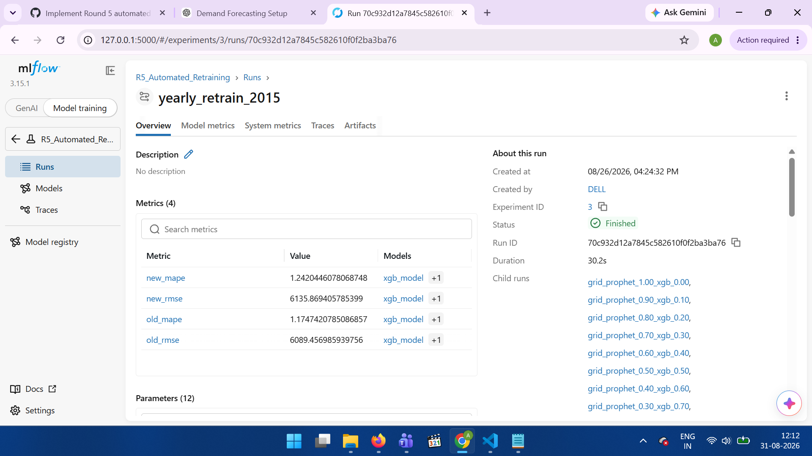
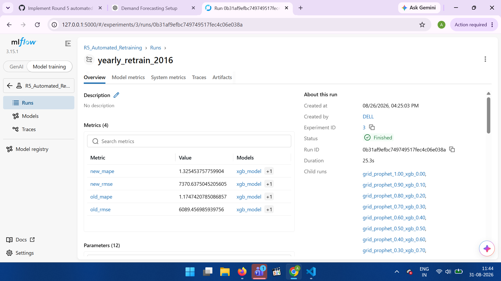

# R5 Automated Retraining Evidence

## Retraining Cycle 1 – 2015

Run Name: yearly_retrain_2015

Status: Finished

Run ID: 70c932d12a7845c582610f0f2ba3ba76

### Model Comparison

| Metric | New Model | Previous Model |
|---|---:|---:|
| MAPE | 1.2420446078068748 | 1.1935308534970082 |
| RMSE | 6135.869405785399 | 6062.616289665733 |

### Ensemble Search

11 ensemble weight combinations were tested automatically.

Selected weights:

- Prophet: 1.0
- XGBoost: 0.0

### Promotion Decision

Promotion Status: REJECTED

Reason: New model did not outperform the previous promoted model.

Evidence: MLflow screenshot – yearly_retrain_2015

---

## Retraining Cycle 2 – 2016

Run Name: yearly_retrain_2016

Status: Finished

Run ID: 0b31af9efbc749749517fec4c06e038a

### Model Comparison

| Metric | New Model | Previous Model |
|---|---:|---:|
| MAPE | 1.325453757759904 | 1.1935308534970082 |
| RMSE | 7370.6375045205605 | 6062.616289665733 |

### Ensemble Search

11 ensemble weight combinations were tested automatically.

Selected weights:

- Prophet: 0.8
- XGBoost: 0.2

### Promotion Decision

Promotion Status: REJECTED

Reason: New model did not outperform the previous promoted model.

Evidence: MLflow screenshot – yearly_retrain_2016

