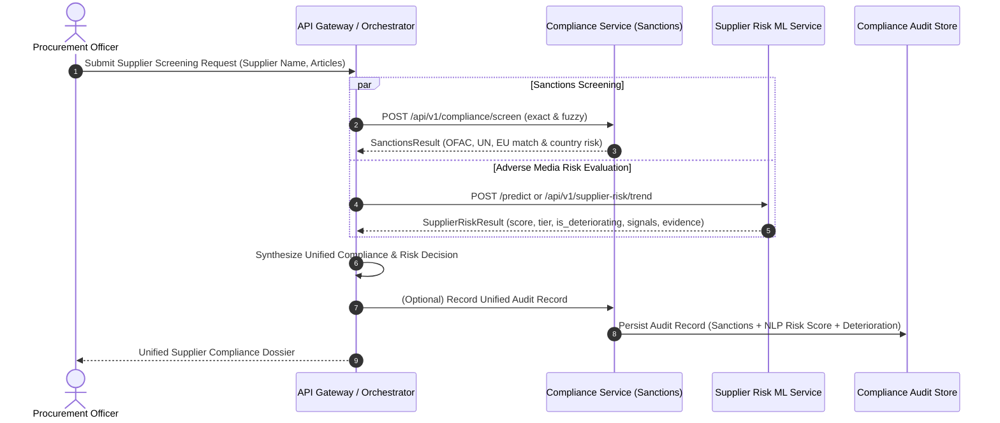

# Compliance Service Integration Contract: Future Consumption Specification

> **Document Status**: ARCHITECTURAL DESIGN & INTERFACE CONTRACT SPECIFICATION ONLY  
> **Target Services**: `services/compliance` & `ml-services/supplier-risk`  
> **Scope Rule**: STRICTLY DOCUMENTATION-FIRST. NO RUNTIME HTTP CLIENTS, SERVICE WIRING, IMPORTS, OR SHARED LIBRARIES ARE IMPLEMENTED IN THIS ROUND. ACTUAL RUNTIME INTEGRATION IS FUTURE WORK.

---

## 1. Overview & Business Rationale

In modern enterprise procurement and supply chain governance, supplier compliance cannot be evaluated solely through static watchlists or isolated financial metrics. A resilient compliance posture requires synthesizing two complementary data streams:

1. **Deterministic Sanctions & Regulatory Screening** (owned by Geethika's Compliance Screening Service):
   - Screens supplier corporate names against official global sanctions lists: **OFAC** (Office of Foreign Assets Control), **UN** (United Nations Security Council), and **EU** (European Union Consolidated Sanctions).
   - Utilizes exact string matching and fuzzy matching (RapidFuzz WRatio) with configurable thresholds.
   - Outputs boolean sanctions hits, matching confidence, matched sanction entities, and regulatory country risk.

2. **Dynamic Adverse Media & Supplier Risk NLP Analysis** (owned by the Supplier Risk ML Service):
   - Continuously analyzes real-world news headlines and adverse media streams using FinBERT sentiment analysis (`ProsusAI/finbert`) and config-driven keyword signal detection (financial distress, operational paralysis, legal/fraud/cyber risks).
   - Computes calibrated 0–100 risk scores, operational triage tiers (Low, Medium, High, Critical), evidence-based confidence metrics, and time-series historical risk trends.
   - Detects and flags suppliers whose risk is **deteriorating over time** (`is_deteriorating: true`, `risk_delta > 0`).

### Objective of Future Integration
When Compliance consumes Supplier Risk data, it will produce a **Unified Supplier Compliance & Risk Profile**. This prevents "sanctions-blind" supplier insolvencies (e.g. an unsanctioned supplier suddenly collapsing due to acute fraud or bankruptcy) while ensuring that acute adverse media alerts trigger proactive compliance audits before legal sanctions are formally enacted.

---

## 2. Integration Boundary & Strict Non-Coupling Invariants

> [!IMPORTANT]
> **Strict Non-Coupling Rules**:
> 1. **No Direct Runtime Coupling**: The Supplier Risk ML Service and Compliance Service remain completely decoupled. Neither service imports, invokes, or hardcodes URLs/endpoints of the other.
> 2. **Contract-First Design**: This document serves as the formal interface definition and agreement.
> 3. **Future Orchestration Layer**: Actual consumption will be orchestrated through the API Gateway (`services/api-gateway`) or an asynchronous message broker / workflow engine in a subsequent implementation round.

---

## 3. Architecture & Data Flow Topology

### Future Orchestration Flow (Asynchronous / API Gateway Facilitated)



---

## 4. Expected Interface Contract

### 4.1 Inbound Consumption Request (from Compliance / Orchestrator to Supplier Risk)

When Compliance requests Supplier Risk intelligence for an entity:

- **Endpoint**: `POST /api/v1/supplier-risk/trend` (or `POST /predict`)
- **Protocol**: HTTP/1.1 REST (JSON over TLS)
- **Headers**:
  - `Content-Type: application/json`
  - `X-Correlation-ID: <uuid>` (for distributed tracing)
  - `Authorization: Bearer <jwt_token>` (validated at API Gateway)

#### Request Payload Schema:
```json
{
  "supplier_name": "Apex Logistics",
  "articles": [
    {
      "date": "2026-03-01",
      "headline": "Analysts issue major downgrade on Apex Logistics amid insolvency fears."
    },
    {
      "date": "2026-03-15",
      "headline": "Regulators launch fraud investigation into Apex Logistics accounting practices."
    },
    {
      "date": "2026-03-22",
      "headline": "Apex Logistics files for emergency restructuring following severe debt default."
    }
  ],
  "as_of_date": "2026-03-23"
}
```

#### Field Specifications:
| Field Name | Type | Required | Constraints | Description |
| :--- | :--- | :---: | :--- | :--- |
| `supplier_name` | `string` | Yes | 1–200 chars, non-blank | Legal or trading name of the supplier being screened. |
| `articles` | `array` | Yes | Max 100 items | Chronologically dated news headlines or regulatory filings. |
| `articles[].date` | `string` | Yes | ISO 8601 `YYYY-MM-DD` | Publication or incident date of the article. |
| `articles[].headline` | `string` | Yes | 1–2000 chars | Cleaned news headline or adverse media snippet. |
| `as_of_date` | `string` | No | ISO 8601 `YYYY-MM-DD` | Optional evaluation reference date (defaults to latest article date). |

---

### 4.2 Outbound Intelligence Response (from Supplier Risk to Compliance)

- **Response Status**: `200 OK`

#### Response Payload Schema:
```json
{
  "supplier": "Apex Logistics",
  "current_risk_score": 100.00,
  "previous_risk_score": 65.40,
  "trend_direction": "rising",
  "is_deteriorating": true,
  "risk_delta": 34.60,
  "deterioration_summary": "Risk is deteriorating: score increased by +34.60 points (from 65.40 to 100.00) exceeding the sensitivity threshold of 3.0.",
  "article_count": 3,
  "current_window_article_count": 3,
  "historical_article_count": 0,
  "window_days": 30,
  "window_start": "2026-02-21",
  "window_end": "2026-03-23",
  "previous_window_start": null,
  "previous_window_end": null,
  "overall_confidence": 0.5482,
  "top_evidence": [
    {
      "headline": "Analysts issue major downgrade on Apex Logistics amid insolvency fears.",
      "sentiment": "negative",
      "score": 103.62,
      "signals": [
        { "keyword": "insolvency", "weight": 45 },
        { "keyword": "downgrade", "weight": 20 }
      ]
    },
    {
      "headline": "Regulators launch fraud investigation into Apex Logistics accounting practices.",
      "sentiment": "negative",
      "score": 101.00,
      "signals": [
        { "keyword": "fraud", "weight": 40 },
        { "keyword": "investigation", "weight": 25 }
      ]
    },
    {
      "headline": "Apex Logistics files for emergency restructuring following severe debt default.",
      "sentiment": "negative",
      "score": 98.68,
      "signals": [
        { "keyword": "default", "weight": 40 },
        { "keyword": "restructuring", "weight": 20 }
      ]
    }
  ],
  "risk_trend": [
    {
      "date": "2026-03-01",
      "risk_score": 100.00,
      "confidence": 0.4502,
      "headline_count": 1,
      "evidence": [...]
    }
  ]
}
```

---

## 5. Unified Risk Decision Matrix

Compliance must synthesize both screening dimensions to determine the final procurement decision:

```text
Sanctions Screening Status + Supplier Risk Score / Deterioration = Unified Compliance Decision
```

| Sanctions Screening Result | Supplier Risk Score & Tier | Risk Deterioration (`is_deteriorating`) | Unified Compliance Status | Recommended Automated Procurement Action |
| :--- | :--- | :---: | :--- | :--- |
| **MATCH** (Exact or Fuzzy $\ge 90$) | Any Score (0–100) | Any | **PROHIBITED / HARD BLOCK** | Immediate transaction freeze, vendor deactivation, and mandatory regulatory reporting (OFAC/UN/EU). |
| **POTENTIAL MATCH** (Fuzzy 75–89) | High or Critical ($\ge 72$) | `true` | **HIGH RISK / ESCALATED** | Mandatory compliance officer review; hold pending purchase orders until identity is resolved. |
| **POTENTIAL MATCH** (Fuzzy 75–89) | Low or Medium ($< 72$) | `false` | **HOLD FOR VERIFICATION** | Secondary name disambiguation and false-positive verification before clearing. |
| **CLEAR** (No Sanctions Match) | Critical ($\ge 85$) | `true` or `false` | **OPERATIONAL DISTRESS / HOLD** | Procurement freeze: Supplier at acute insolvency, bankruptcy, or fraud risk. Activate backup suppliers. |
| **CLEAR** (No Sanctions Match) | High ($72 - 84.9$) | `true` | **ELEVATED RISK / EDD** | Enhanced Due Diligence (EDD): Require audited financial statements and contingency supply contracts. |
| **CLEAR** (No Sanctions Match) | High ($72 - 84.9$) | `false` (Stable / Improving) | **MONITORED** | Weekly automated re-screening; limit single-order contract value exposure. |
| **CLEAR** (No Sanctions Match) | Medium ($60 - 71.9$) | `true` | **WATCHLIST** | Flag for monthly review; notify category procurement manager of deteriorating risk trend. |
| **CLEAR** (No Sanctions Match) | Low or Medium | `false` | **APPROVED / AUTO-CLEAR** | Standard procurement clearance; routine scheduled re-screening (e.g. quarterly). |

---

## 6. Resilience, Fallbacks & Error Handling

To ensure high availability and prevent cascading system failures:

1. **Graceful Service Degradation**:
   - If the Supplier Risk ML service is unreachable, times out ($> 3000\,\text{ms}$), or returns `5xx`:
     - Compliance **MUST NOT** crash or abort sanctions screening.
     - Compliance proceeds with sanctions-only screening.
     - Compliance attaches a metadata warning flag in the audit record:
       ```json
       {
         "supplier_risk_evaluated": false,
         "supplier_risk_error": "Supplier Risk service unreachable: timeout after 3000ms",
         "compliance_status": "PROVISIONALLY_CLEARED_PENDING_NLP_RISK"
       }
       ```
2. **Circuit Breaking**:
   - The orchestrating gateway should implement a circuit breaker (e.g. open after 5 consecutive failures, 30s half-open probe).
3. **Idempotency**:
   - All risk evaluation requests are side-effect-free (read-only compute) and safely retryable.

---

## 7. Audit Logging & Compliance Traceability

In accordance with compliance audit standards (SOX, ISO 27001):

- Every unified evaluation must be persisted in the Compliance Service audit store with:
  1. `screening_id`: Unique screening UUID.
  2. `sanctions_summary`: Match status, matched lists (OFAC/UN/EU), match confidence.
  3. `nlp_risk_summary`: Raw score, tier, deterioration flag, risk delta, peak signals detected.
  4. `evidence_snapshot`: Top 3 driving headlines and publication dates.
  5. `timestamp`: UTC ISO 8601 timestamp.
  6. `analyst_override`: If an analyst overrides a flag, record analyst user ID and justification.

---

## 8. Future Implementation Roadmap

When the project transitions from contract-first specification to runtime integration:

- **Phase 1 (Interface Finalization)**: Establish OpenAPI schemas and shared contract validation in test suites.
- **Phase 2 (Gateway Orchestration)**: Implement composite screening endpoint in `services/api-gateway` invoking both services concurrently.
- **Phase 3 (Unified Storage)**: Extend `services/compliance` audit models to store NLP risk scores and deterioration flags.
- **Phase 4 (Automated Alerts & Webhooks)**: Emit webhook events when a previously cleared supplier's risk transitions to `is_deteriorating: true`.
