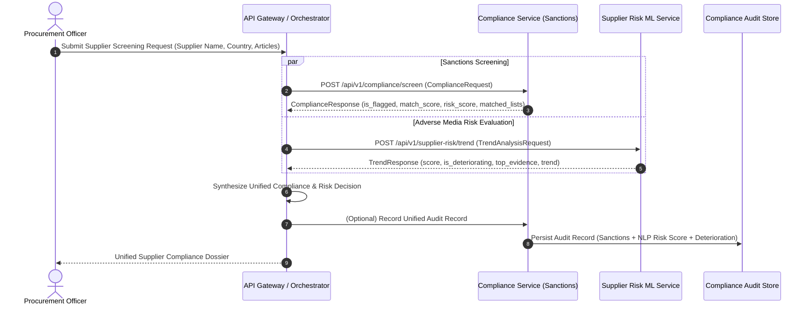

# Compliance Service Integration Contract: Future Consumption Specification

> **Document Status**: ARCHITECTURAL DESIGN & INTERFACE CONTRACT SPECIFICATION ONLY
> **Target Services**: `services/compliance` (Sanctions Screening) & `ml-services/supplier-risk` (Adverse Media NLP & Risk Trend)
> **Scope Rule**: STRICTLY DOCUMENTATION-FIRST. NO RUNTIME HTTP CLIENTS, SERVICE WIRING, IMPORTS, OR SHARED LIBRARIES ARE IMPLEMENTED IN THIS ROUND. ACTUAL RUNTIME INTEGRATION IS FUTURE WORK.

---

## 1. Overview & Business Rationale

In modern enterprise procurement and supply chain governance, supplier compliance cannot be evaluated solely through static watchlists or isolated financial metrics. A resilient compliance posture requires synthesizing two complementary data streams:

1. **Deterministic Sanctions & Regulatory Screening** (owned by Geethika's Compliance Screening Service in `services/compliance`):
   - Screens supplier corporate names against official global watchlists: **OFAC** (Office of Foreign Assets Control), **UN** (United Nations Security Council), and **EU** (European Union Consolidated Sanctions).
   - Utilizes exact string matching and fuzzy matching (RapidFuzz WRatio).
   - Match threshold depends on the screening tier (`app/services/screening_tier_service.py`):
     `screening_tier = max(country risk tier, transaction value tier)`, then
     LOW → 90, MEDIUM → 85, HIGH → 80 (`LOW/MEDIUM/HIGH_TIER_MATCH_THRESHOLD`).
     A high-value transaction is therefore flagged at a lower fuzzy score.
   - Every response carries `screening_tier` (LOW/MEDIUM/HIGH), `enhanced_review_required`
     (true when HIGH) and `screening_action`
     (`STANDARD_SCREENING` / `ADDITIONAL_COMPLIANCE_REVIEW` / `ENHANCED_REVIEW_AND_MANUAL_APPROVAL`).
   - When `is_flagged` is true, the service opens a case and returns `case_id`, `case_number`
     and `case_status` (OPEN / UNDER_REVIEW / CLEARED / CONFIRMED).
   - Records match score, matched lists, entity aliases, and calculated risk factors (`match_confidence`, `source_coverage`, `recency`).

2. **Dynamic Adverse Media & Supplier Risk NLP Analysis** (owned by the Supplier Risk ML Service in `ml-services/supplier-risk`):
   - Continuously analyzes real-world news headlines and adverse media streams using FinBERT sentiment analysis (`ProsusAI/finbert`) and config-driven keyword signal detection (financial distress, operational paralysis, legal/fraud/cyber risks).
   - Computes calibrated 0–100 risk scores, operational triage tiers (Low, Medium, High, Critical), evidence-based confidence metrics, and time-series historical risk trends.
   - Aggregates rolling window risk using principled anti-dilution (`top_k_mean`), ensuring acute distress signals are not diluted by neutral or positive headlines.
   - Detects and flags suppliers whose risk is **deteriorating over time** (`is_deteriorating: true`, `risk_delta > 0`).

### Objective of Future Integration
When Compliance consumes Supplier Risk data, it will produce a **Unified Supplier Compliance & Risk Profile**. This prevents "sanctions-blind" supplier insolvencies (e.g. an unsanctioned supplier suddenly collapsing due to acute fraud or bankruptcy) while ensuring that acute adverse media alerts trigger proactive compliance audits before legal sanctions are formally enacted.

---

## 2. Integration Boundary & Strict Non-Coupling Invariants

> [!IMPORTANT]
> **Strict Non-Coupling Rules**:
> 1. **No Direct Runtime Coupling**: The Supplier Risk ML Service and Compliance Service remain completely decoupled. Neither service imports, invokes, or hardcodes URLs/endpoints of the other.
> 2. **Contract-First Design**: This document serves as the formal interface definition and agreement.
> 3. **Future Orchestration Layer**: Actual consumption will be orchestrated through the API Gateway (`services/api-gateway`) or an asynchronous message broker / workflow engine in a subsequent implementation round.

---

## 3. Architecture & Data Flow Topology

### Future Orchestration Flow (Asynchronous / API Gateway Facilitated)



---

## 4. Expected Interface Contract

### 4.1 Inbound Consumption Request (from Compliance / Orchestrator to Supplier Risk)

When Compliance requests Supplier Risk intelligence for an entity:

- **Endpoints**:
  - `POST /api/v1/supplier-risk/trend` (dynamic custom article evaluation)
  - `GET /api/v1/supplier-risk/trend/{supplier_name}` (retrieval by supplier name)
  - `POST /predict` (instant single/batch headline scoring)
- **Protocol**: HTTP/1.1 REST (JSON over TLS)
- **Headers**:
  - `Content-Type: application/json`
  - `X-Correlation-ID: <uuid>` (for distributed tracing)
  - `Authorization: Bearer <jwt_token>` (validated at API Gateway)

#### Request Payload Schema:
```json
{
  "supplier_name": "Apex Logistics",
  "articles": [
    {
      "date": "2026-02-05",
      "headline": "Apex Logistics completes minor warehouse maintenance routine."
    },
    {
      "date": "2026-02-15",
      "headline": "Apex Logistics renews local commercial fleet insurance policies."
    },
    {
      "date": "2026-03-01",
      "headline": "Analysts issue major downgrade on Apex Logistics amid insolvency fears."
    },
    {
      "date": "2026-03-15",
      "headline": "Regulators launch fraud investigation into Apex Logistics accounting practices."
    },
    {
      "date": "2026-03-22",
      "headline": "Apex Logistics files for emergency restructuring following severe debt default."
    }
  ],
  "as_of_date": "2026-03-23"
}
```

#### Field Specifications:
| Field Name | Type | Required | Constraints | Description |
| :--- | :--- | :---: | :--- | :--- |
| `supplier_name` | `string` | Yes | 1–200 chars, non-blank | Legal or trading name of the supplier being screened. |
| `articles` | `array` | Yes | Max 100 items | Chronologically dated news headlines or regulatory filings. |
| `articles[].date` | `string` | Yes | ISO 8601 `YYYY-MM-DD` | Publication or incident date of the article. |
| `articles[].headline` | `string` | Yes | 1–2000 chars, non-blank | Cleaned news headline or adverse media snippet. Empty or whitespace-only headlines are rejected with HTTP 422. |
| `as_of_date` | `string` | No | ISO 8601 `YYYY-MM-DD` | Optional evaluation reference date (defaults to latest article date). Controls rolling window boundaries: current window ends at `as_of_date` and starts at `as_of_date - 30 days`. Articles published after `as_of_date` are excluded. |

> Per-headline score in `top_evidence` / `risk_trend[].evidence` is uncapped and can exceed 100. Only aggregate scores are capped at 100.

---

### 4.2 Outbound Intelligence Response (from Supplier Risk to Compliance)

- **Response Status**: `200 OK`

#### Response Payload Schema (Actual Runtime Output of Documented Example Request):
```json
{
  "supplier": "Apex Logistics",
  "current_risk_score": 100.0,
  "previous_risk_score": 27.93,
  "current_risk_tier": "Critical",
  "previous_risk_tier": "Low",
  "peak_risk_score": 100.0,
  "peak_risk_tier": "Critical",
  "trend_direction": "rising",
  "is_deteriorating": true,
  "risk_delta": 72.07,
  "deterioration_summary": "Risk is deteriorating: score increased by +72.07 points (from 27.93 Low to 100.00 Critical).",
  "article_count": 5,
  "current_window_article_count": 3,
  "historical_article_count": 2,
  "window_days": 30,
  "window_start": "2026-02-21",
  "window_end": "2026-03-23",
  "previous_window_start": "2026-02-05",
  "previous_window_end": "2026-02-15",
  "overall_confidence": 0.1031,
  "top_evidence": [
    {
      "headline": "Analysts issue major downgrade on Apex Logistics amid insolvency fears.",
      "sentiment": "negative",
      "score": 104.2,
      "signals": [
        {
          "keyword": "insolvency",
          "weight": 45
        },
        {
          "keyword": "downgrade",
          "weight": 20
        }
      ]
    },
    {
      "headline": "Regulators launch fraud investigation into Apex Logistics accounting practices.",
      "sentiment": "negative",
      "score": 104.2,
      "signals": [
        {
          "keyword": "fraud",
          "weight": 40
        },
        {
          "keyword": "investigation",
          "weight": 25
        }
      ]
    },
    {
      "headline": "Apex Logistics files for emergency restructuring following severe debt default.",
      "sentiment": "negative",
      "score": 99.2,
      "signals": [
        {
          "keyword": "default",
          "weight": 40
        },
        {
          "keyword": "restructuring",
          "weight": 20
        }
      ]
    }
  ],
  "risk_trend": [
    {
      "date": "2026-02-05",
      "risk_score": 0.0,
      "confidence": 0.0588,
      "headline_count": 1,
      "evidence": []
    },
    {
      "date": "2026-02-15",
      "risk_score": 0.0,
      "confidence": 0.0588,
      "headline_count": 1,
      "evidence": []
    },
    {
      "date": "2026-03-01",
      "risk_score": 100.0,
      "confidence": 0.1175,
      "headline_count": 1,
      "evidence": [
        {
          "headline": "Analysts issue major downgrade on Apex Logistics amid insolvency fears.",
          "sentiment": "negative",
          "score": 104.2,
          "signals": [
            {
              "keyword": "insolvency",
              "weight": 45
            },
            {
              "keyword": "downgrade",
              "weight": 20
            }
          ]
        }
      ]
    },
    {
      "date": "2026-03-15",
      "risk_score": 100.0,
      "confidence": 0.1175,
      "headline_count": 1,
      "evidence": [
        {
          "headline": "Regulators launch fraud investigation into Apex Logistics accounting practices.",
          "sentiment": "negative",
          "score": 104.2,
          "signals": [
            {
              "keyword": "fraud",
              "weight": 40
            },
            {
              "keyword": "investigation",
              "weight": 25
            }
          ]
        }
      ]
    },
    {
      "date": "2026-03-22",
      "risk_score": 99.2,
      "confidence": 0.1174,
      "headline_count": 1,
      "evidence": [
        {
          "headline": "Apex Logistics files for emergency restructuring following severe debt default.",
          "sentiment": "negative",
          "score": 99.2,
          "signals": [
            {
              "keyword": "default",
              "weight": 40
            },
            {
              "keyword": "restructuring",
              "weight": 20
            }
          ]
        }
      ]
    }
  ]
}
```

---

### 4.3 Sanctions Screening Contract (Geethika's Compliance Screening Service)

The sanctions screening service in `services/compliance` exposes:
- **Base Prefix**: `/api/v1/compliance`
- **Endpoint**: `POST /api/v1/compliance/screen`
- **Request Model**: `ComplianceRequest`
  ```json
  {
    "entity_name": "Apex Logistics",
    "entity_type": "supplier",
    "country": "United States",
    "transaction_value": 2500000.0
  }
  ```

#### Field Specifications (`ComplianceRequest`):
| Field Name | Type | Required | Constraints | Description |
| :--- | :--- | :---: | :--- | :--- |
| `entity_name` | `string` | Yes | 1+ chars, non-blank | Legal name of entity to screen. |
| `entity_type` | `string` | Yes | `"supplier"` or `"customer"` | Entity category. |
| `country` | `string` | Yes | 1+ chars, non-blank | Operating or incorporation country. |
| `transaction_value` | `float` | No | $\ge 0.0$, default `0.0` | Transaction value in INR. Combined with country risk to determine the screening tier. |

- **Response Model**: `ComplianceResponse`

##### Illustrative Response — Standard Screening (Unflagged):
```json
{
  "entity_name": "Apex Logistics",
  "entity_type": "supplier",
  "country": "United States",
  "transaction_value": 2500000.0,
  "screening_tier": "MEDIUM",
  "enhanced_review_required": false,
  "screening_action": "ADDITIONAL_COMPLIANCE_REVIEW",
  "is_flagged": false,
  "matched_lists": [],
  "matched_count": 0,
  "matched_name": null,
  "aliases": [],
  "match_score": 0,
  "confidence": 0.0,
  "risk_score": 0.0,
  "risk_factors": {
    "match_confidence": 0.0,
    "source_coverage": 0.0,
    "recency": 0.0
  },
  "country_risk_score": 20.0,
  "overall_supplier_risk": 4.0,
  "duration_ms": 0.21,
  "source": [],
  "override_applied": false,
  "override_reason": null,
  "reviewed_by": null,
  "case_id": null,
  "case_number": null,
  "case_status": null
}
```

##### Illustrative Response — High Tier Sanctions Match (Flagged with Automated Case Creation):
```json
{
  "entity_name": "HAMAS",
  "entity_type": "supplier",
  "country": "India",
  "transaction_value": 6000000.0,
  "screening_tier": "HIGH",
  "enhanced_review_required": true,
  "screening_action": "ENHANCED_REVIEW_AND_MANUAL_APPROVAL",
  "is_flagged": true,
  "matched_lists": [
    "OFAC"
  ],
  "matched_count": 1,
  "matched_name": "HAMAS",
  "aliases": [],
  "match_score": 100,
  "confidence": 1.0,
  "risk_score": 66.0,
  "risk_factors": {
    "match_confidence": 100.0,
    "source_coverage": 20.0,
    "recency": 0.0
  },
  "country_risk_score": 30.0,
  "overall_supplier_risk": 58.8,
  "duration_ms": 0.0,
  "source": [
    "OFAC"
  ],
  "override_applied": false,
  "override_reason": null,
  "reviewed_by": null,
  "case_id": 1,
  "case_number": "CASE-000001",
  "case_status": "OPEN"
}
```

#### Field Specifications (`ComplianceResponse`):
*(Field definitions copied directly from `ComplianceResponse` in `services/compliance/app/schemas/compliance.py`; example values are illustrative)*

| Field Name | Type | Description | Illustrative Value |
| :--- | :--- | :--- | :--- |
| `entity_name` | `string \| null` | Screened entity name. | `"Apex Logistics"` |
| `entity_type` | `string` | Entity category (`"supplier"` or `"customer"`). | `"supplier"` |
| `country` | `string` | Country associated with the entity. | `"United States"` |
| `transaction_value` | `float` | Transaction value in INR (min: 0.0, default: 0.0). | `2500000.0` |
| `screening_tier` | `string` | Screening tier: `"LOW"`, `"MEDIUM"`, or `"HIGH"`. | `"MEDIUM"` |
| `enhanced_review_required` | `boolean` | True when screening tier is `"HIGH"`. | `false` |
| `screening_action` | `string` | Screening action (`"STANDARD_SCREENING"`, `"ADDITIONAL_COMPLIANCE_REVIEW"`, or `"ENHANCED_REVIEW_AND_MANUAL_APPROVAL"`). | `"ADDITIONAL_COMPLIANCE_REVIEW"` |
| `is_flagged` | `boolean` | True if sanctions match score exceeds tier threshold. | `false` |
| `matched_lists` | `array[string]` | Watchlists where entity matched (e.g. `["OFAC"]`). | `[]` |
| `matched_count` | `integer` | Count of matched lists. | `0` |
| `matched_name` | `string \| null` | Official watchlist entry name matched. | `null` |
| `aliases` | `array[string]` | Known aliases from watchlist record. | `[]` |
| `match_score` | `integer` | Fuzzy match score (0–100). | `0` |
| `confidence` | `float` | Composite match confidence score (0.0–1.0). | `0.0` |
| `risk_score` | `float` | Calculated sanctions risk score (0.0–100.0). | `0.0` |
| `risk_factors` | `object` | Detailed risk components (`match_confidence`, `source_coverage`, `recency`). | `{"match_confidence": 0.0, "source_coverage": 0.0, "recency": 0.0}` |
| `country_risk_score` | `float` | Base country risk score from country index. | `20.0` |
| `overall_supplier_risk` | `float` | Weighted overall risk combining sanctions and country risk. | `4.0` |
| `duration_ms` | `float` | Screening execution latency in milliseconds. | `0.21` |
| `source` | `array[string]` | Synonymous with matched_lists for audit persistence. | `[]` |
| `override_applied` | `boolean` | True if a human analyst compliance override was applied. | `false` |
| `override_reason` | `string \| null` | Justification note if override applied. | `null` |
| `reviewed_by` | `string \| null` | Officer identity if override applied. | `null` |
| `case_id` | `integer \| null` | Database ID of the created/assigned compliance case. Populated when `is_flagged` is true. | `null` (or `1` if flagged) |
| `case_number` | `string \| null` | Unique case reference number (e.g. `"CASE-000001"`). Populated when `is_flagged` is true. | `null` (or `"CASE-000001"` if flagged) |
| `case_status` | `string \| null` | Case lifecycle state: `"OPEN"`, `"UNDER_REVIEW"`, `"CLEARED"`, `"CONFIRMED"`. Populated when `is_flagged` is true. | `null` (or `"OPEN"` if flagged) |

---

## 5. Unified Risk Decision Matrix

Compliance synthesizes both screening dimensions to determine the final procurement decision:

```text
Sanctions Screening Flag + Supplier Risk Score / Deterioration = Unified Compliance Decision
```

Inputs:

- Compliance: `is_flagged`, `case_status`, `screening_action`
- Supplier Risk: `peak_risk_tier`, `is_deteriorating`

| is_flagged / case_status | peak_risk_tier | is_deteriorating | Unified status | Action |
| --- | --- | --- | --- | --- |
| true, case not `CLEARED` | Any | Any | PROHIBITED / HARD BLOCK | Freeze transactions until the compliance case is CLEARED. |
| false (or case `CLEARED`) | Critical | Any | OPERATIONAL DISTRESS / HOLD | Hold pending POs; activate alternate suppliers. |
| false (or case `CLEARED`) | High | true | ELEVATED RISK / EDD | Enhanced due diligence before approving orders. |
| false (or case `CLEARED`) | High | false | MONITORED | Weekly re-screening; cap single-order value. |
| false (or case `CLEARED`) | Medium | true | WATCHLIST | Monthly review; notify category manager. |
| false (or case `CLEARED`) | Medium | false | ROUTINE REVIEW | Standard clearance with periodic screening. |
| false (or case `CLEARED`) | Low | false | AUTO-CLEAR | Standard clearance. |

- Final action = the stricter of this table's action and Compliance's own `screening_action` (for example, Low plus `ENHANCED_REVIEW_AND_MANUAL_APPROVAL` still requires manual approval).
- `peak_risk_tier = Low` with `is_deteriorating = true` cannot occur, because deterioration requires a tier increase or a High/Critical current tier.

---

## 6. Resilience, Fallbacks & Error Handling

To ensure high availability and prevent cascading system failures:

1. **Graceful Service Degradation**:
   - If the Supplier Risk ML service is unreachable, times out ($> 3000\,\text{ms}$), or returns `5xx`:
     - Compliance **MUST NOT** crash or abort sanctions screening.
     - Compliance proceeds with sanctions-only screening.
     - Compliance attaches a metadata warning flag in the audit record:
       ```json
       {
         "supplier_risk_evaluated": false,
         "supplier_risk_error": "Supplier Risk service unreachable: timeout after 3000ms",
         "compliance_status": "PROVISIONALLY_CLEARED_PENDING_NLP_RISK"
       }
       ```
2. **Circuit Breaking**:
   - The orchestrating gateway should implement a circuit breaker (e.g. open after 5 consecutive failures, 30s half-open probe).
3. **Idempotency**:
   - All risk evaluation requests are side-effect-free (read-only compute) and safely retryable.

---

## 7. Audit Logging & Compliance Traceability

In accordance with compliance audit standards (SOX, ISO 27001):

- Every unified evaluation must be persisted in the Compliance Service audit store with:
  1. `screening_id`: Unique screening UUID.
  2. `sanctions_summary`: Match status, matched lists (OFAC/UN/EU), match score, confidence.
  3. `nlp_risk_summary`: Raw score, tier, deterioration flag, risk delta, peak signals detected.
  4. `evidence_snapshot`: Top 3 driving headlines and publication dates.
  5. `timestamp`: UTC ISO 8601 timestamp.
  6. `analyst_override`: If an analyst overrides a flag, record analyst user ID and justification.

---

## 8. Current vs. Proposed/Future Behavior

| Dimension | Documented Current Behavior (Implemented) | Proposed / Future Orchestration (Phase 2+) |
| :--- | :--- | :--- |
| **Supplier Risk Trend Endpoints** | Implemented as `POST /api/v1/supplier-risk/trend` and `GET /api/v1/supplier-risk/trend/{supplier_name}` with `as_of_date` cutoff, `top_k_mean` anti-dilution, and deterioration detection. | Invoked concurrently by API Gateway during composite screening workflows. |
| **Compliance Screening Endpoint** | Implemented as `POST /api/v1/compliance/screen` in `services/compliance` with OFAC/UN/EU matching, tiered match thresholds (90/85/80), and case management. | Extended with composite screening endpoint joining sanctions hits with adverse media risk. |
| **Cross-Service Communication** | Fully decoupled; no runtime HTTP clients or shared libraries. | Orchestrated through API Gateway (`services/api-gateway`) or message broker. |
| **Audit Record Persistence** | Individual services maintain their own database audit records independently. | Unified audit table storing combined sanctions and adverse media snapshots. |
