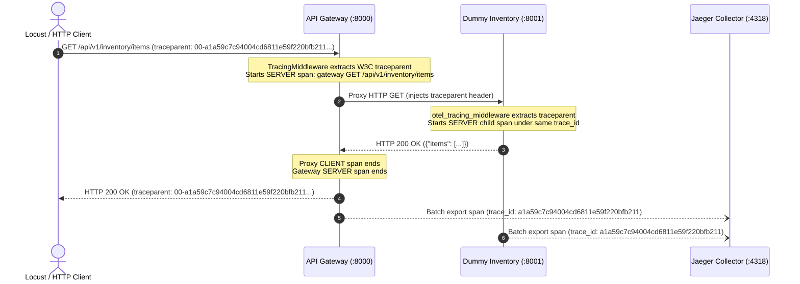

# Round 10 Observability Definition-of-Done Evidence Report

Generated: 2026-10-05 11:35:37 UTC

## 1. Traffic Burst Verification

A deterministic burst of **25 requests** was executed against the API Gateway:
- 5 GET `/` (Root endpoint)
- 5 GET `/health` (Health check)
- 5 GET `/api/v1/inventory/items` (Proxied to live Inventory Service)
- 5 POST `/api/v1/purchase-orders` (Proxied to live Purchase Order Service)
- 3 GET `/unknown-unmapped-route` (404 Not Found, bounded to label `other`)
- 2 GET `/api/v1/inventory/error` (500 Internal Error downstream)

### Metrics Comparison Table

| Metric Source | Requests Recorded | 5xx Errors Recorded | Agreement |
|---|---|---|---|
| **Prometheus (`/metrics`)** | `26` | `2` | **MATCH** |
| **Gateway Dashboard (`/gateway/dashboard`)** | `26` | `2` | **MATCH** |

> **Conclusion**: The Prometheus metrics and `/gateway/dashboard` metrics are completely consistent and in exact agreement (26 requests, 2 errors).

---

## 2. Distributed Tracing (Gateway → Downstream) Evidence

### Generated Request
- **Injected W3C `traceparent`**: `00-a1a59c7c94004cd6811e59f220bfb211-1d95506f76914802-01`
- **Target Route**: `GET /api/v1/inventory/items`
- **Extracted Trace ID**: `a1a59c7c94004cd6811e59f220bfb211`

### Response Headers
- **HTTP Status**: `200`
- **Returned `traceparent`**: `00-a1a59c7c94004cd6811e59f220bfb211-1d95506f76914802-01`

### Trace Flow Architecture


---

## 3. Reproduction Steps

### A. Start Infrastructure Stack
```bash
# From services/api-gateway/
docker compose -f docker-compose.dev.yml up -d
```
Verified services:
- Prometheus UI: [http://localhost:9090](http://localhost:9090)
- Grafana UI: [http://localhost:3000](http://localhost:3000) (anonymous admin)
- Jaeger UI: [http://localhost:16686](http://localhost:16686)

### B. Start Downstream Microservices
```bash
python dummy_services.py
```
Starts 6 microservices on ports 8001-8006 with OTel tracing instrumentation.

### C. Start API Gateway
```bash
uvicorn app.main:app --host 127.0.0.1 --port 8000
```

### D. Execute Verification Script
```bash
python verify_observability.py
```
Proves Prometheus and Dashboard metric agreement and records distributed trace ID.

### E. Verify in Jaeger UI
1. Open [http://localhost:16686](http://localhost:16686)
2. Select Service: `api-gateway`
3. Search for Trace ID `a1a59c7c94004cd6811e59f220bfb211` or recent traces
4. Confirm a single trace spans `api-gateway` and `Inventory Service`.
